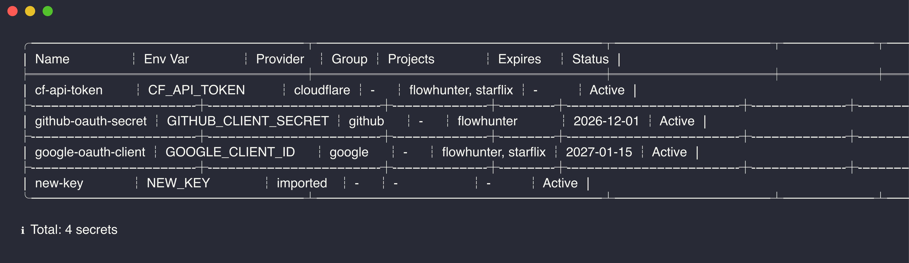
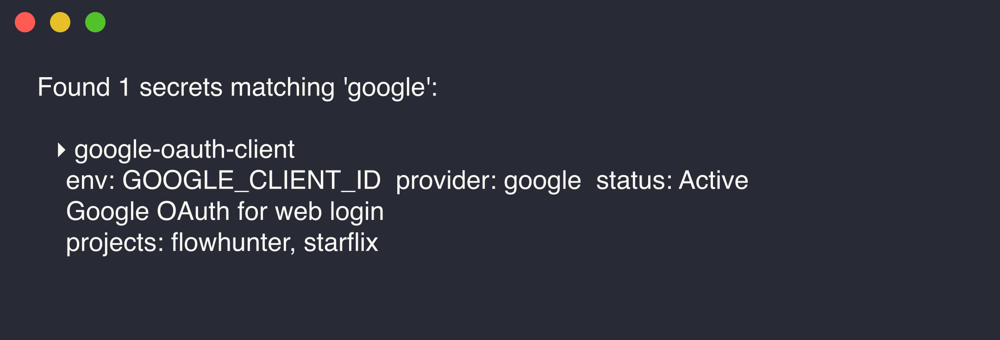
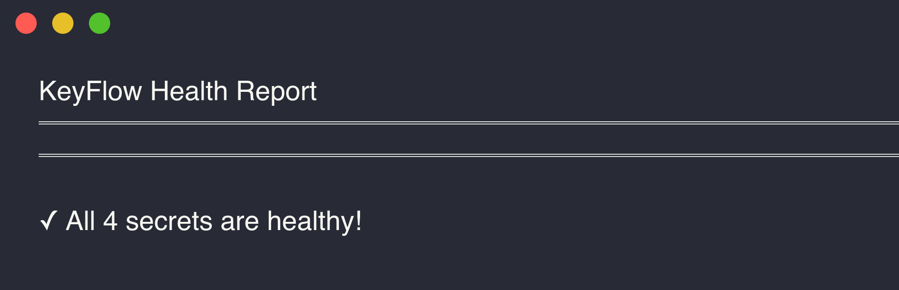

<div align="center">

# KeyFlow

**Developer key vault — store once, search fast, reuse everywhere, AI-safe**

[](#)
[](LICENSE)
[](#ai-integration)
[](https://keyflow.divinations.top)

**[中文文档](README.zh.md)**

</div>

## Install

```bash
brew tap nianyi778/keyflow && brew install keyflow
# or
cargo install --git https://github.com/nianyi778/keyflow
```

## 30-Second Quickstart

```bash
kf init                                              # Create encrypted vault
kf add OPENAI_API_KEY sk-xxx --provider openai       # Store a key
kf search resend                                     # Find a key
kf run --project myapp -- npm start                  # Inject env vars and run
kf export --project myapp -o .env                    # Export .env
kf import ./myapp                                    # Import .env files from a project
kf health                                            # Check key hygiene
```

> `kf` is a shorthand for `keyflow`. Both work.

## Screenshots

<table>
<tr>
<td width="50%">

**`kf list`**


</td>
<td width="50%">

**`kf search`**


</td>
</tr>
<tr>
<td width="50%">

**`kf health`**


</td>
</tr>
</table>

## AI Integration

Built-in MCP server. One command to connect any AI coding tool:

```bash
kf setup claude    # or cursor / windsurf / gemini / opencode / codex / zed / cline / roo
```

AI sees metadata only (name, provider, project, status) — never the secret value. 10 tools organized by discover / inspect / reuse / maintain. See [MCP contract](docs/mcp-contract.md) for details.

Manual config:

```json
{ "mcpServers": { "keyflow": { "command": "kf", "args": ["serve"] } } }
```

## Cloud Sync

End-to-end encrypted sync. The server never sees plaintext:

```bash
kf sync init       # Register and bind to cloud
kf sync run        # Push and pull
```

## Commands

| Command | Description |
|---------|-------------|
| `kf init` | Initialize vault |
| `kf add` | Add a secret |
| `kf list` | List secrets |
| `kf get <name>` | Retrieve secret value |
| `kf search <query>` | Search |
| `kf scan <path>` | Scan .env candidates |
| `kf update <name>` | Update metadata |
| `kf verify <name>` | Mark key as still valid |
| `kf remove <name>` | Delete |
| `kf run -- <cmd>` | Inject env vars and run |
| `kf import <path>` | Import .env files |
| `kf export` | Export .env |
| `kf health` | Health check |
| `kf setup` | Configure AI integration |
| `kf sync` | Cloud sync |
| `kf backup` / `kf restore` | Backup / restore |
| `kf passwd` | Change master password |
| `kf lock` | Lock vault |

## Security

- **AES-256-GCM** encryption, **Argon2** key derivation
- Local storage: macOS `~/Library/Application Support/keyflow/`, Linux `~/.local/share/keyflow/`
- MCP exposes metadata only, never secret values
- `.passphrase` file is `0600`, `kf lock` clears it instantly
- `kf run` injects at runtime — plaintext never hits disk
- Auto-detection for 20+ providers (Google, GitHub, Cloudflare, AWS, OpenAI, etc.)

## License

[MIT](LICENSE) - Copyright (c) 2026 nianyi778
