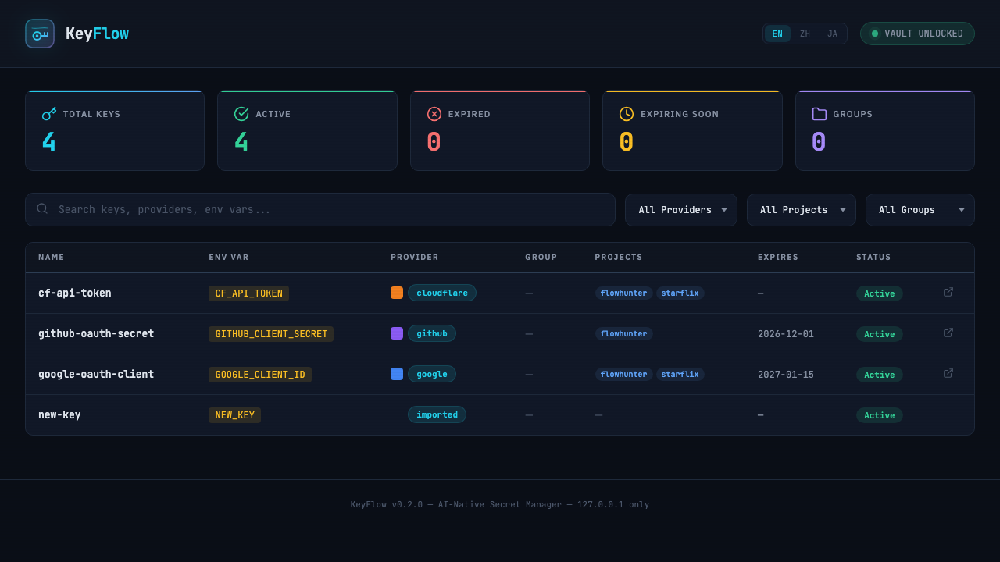
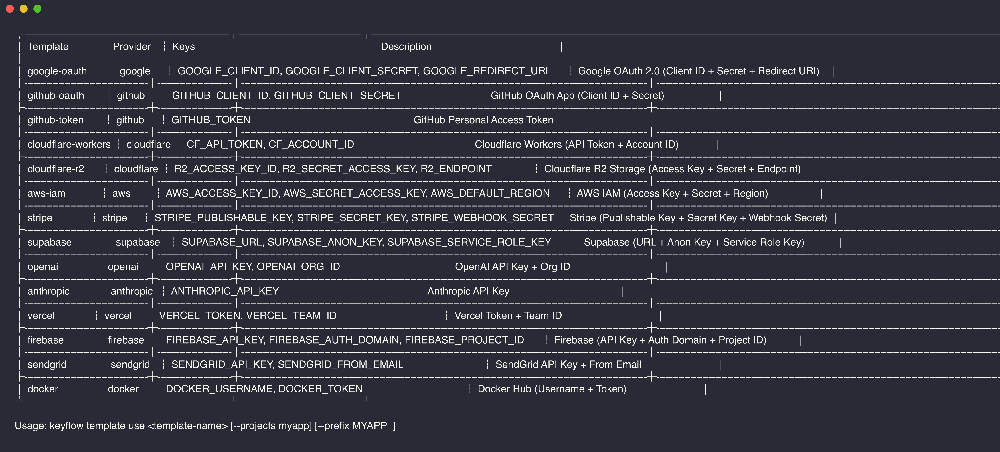
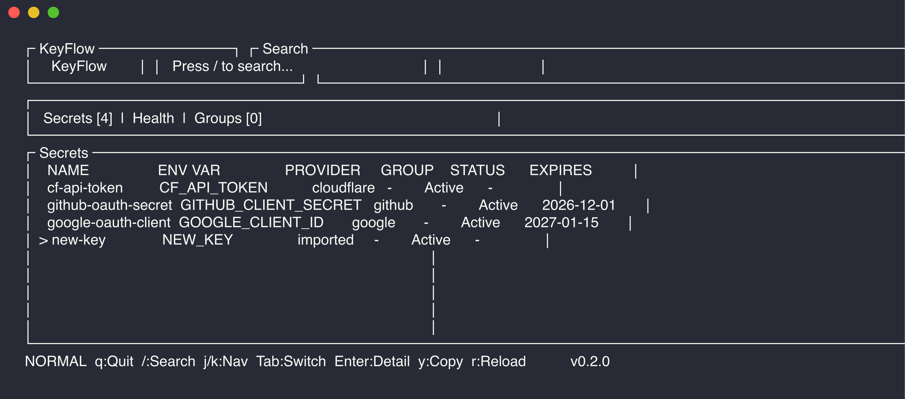

<div align="center">

# KeyFlow

**为开发者和 AI 编码用户准备的密钥资产库**

把你已经申请过、已经用过的 API Key、Token、环境变量沉淀下来，后面能查、能复用、能注入、能清理。

[](#)
[](LICENSE)
[](#ai-集成可选)

</div>

---

## 这是什么

`KeyFlow` 不是帮你“申请密钥”的工具。

它解决的是更实际的问题：
- 你以前申请过 Google、GitHub、Cloudflare、Resend、OpenAI、Stripe 等 key
- 过几周后，你忘了当时申请的是哪一个、变量名是什么、给哪个项目用
- 找不到就会重复申请
- AI 会帮你写代码，但它不知道你本地到底已经有哪些可复用的密钥

**KeyFlow 的目标，是把这些一次性的 key，变成可搜索、可复用的长期开发资产。**

你可以用它：
- 保存已经申请过的 key
- 按 `provider / project / group / account / source` 管理
- 搜索并复用旧 key，避免重复申请
- 导出 `.env` 或在运行时注入环境变量
- 查看哪些 key 快过期、长期未用、信息不完整
- 可选地让 AI 读取元数据，知道有哪些 key 可以复用

## 它怎么工作

```text
你                             KeyFlow
 │                                │
 │  add / import                  │
 │ ────────────────────────────►  │  加密保存到本地 vault
 │                                │
 │  kf search resend              │
 │ ◄────────────────────────────  │  找到历史上存过的 key
 │                                │
 │  kf run -- npm dev             │
 │ ◄────────────────────────────  │  注入环境变量运行项目
 │                                │
 │  可选：给 AI 接 MCP            │
 │ ◄────────────────────────────  │  只暴露元数据，不暴露密钥值
```

## 最重要的边界

### 1. 它不会偷偷自动保存你的密钥

当前会入库的情况只有这些：
- 你显式执行 `kf add`
- 你显式执行 `kf import`
- AI 通过 MCP 明确调用 `add_key`

当前不会发生这些事：
- 不会自动监听你的 AI 对话并偷偷保存 token
- 不会自动扫描所有终端输出后直接入库
- 不会因为你在聊天里贴了一段 key 就静默保存

这是故意这样设计的。密钥管理不应该做成黑盒自动采集。

### 2. `add_key` 是 AI 工具名，不是让你手写的命令

如果你接入了支持 MCP 的 AI 工具，正确用法是自然语言：
- “把这个 Resend key 存到 KeyFlow，account 记成 acme-mail”
- “把刚申请的 Cloudflare token 保存起来，项目是 marketing-site”

AI 在后台会调用 `add_key`。

你不需要在聊天窗口里手写 `add_key`。

### 3. AI 不是主入口，`CLI + Web` 才是主入口

当前产品主线是：
- `CLI`：新增、导入、搜索、导出、运行时注入
- `Web`：可视化浏览、过滤、健康检查

`kf ui` 仍然可用，但现在是实验性 TUI，不是主入口。

### 4. 健康提醒不只看过期时间

现实里很多 API Key 根本没有明确的过期时间。

所以 `KeyFlow` 的提醒逻辑不能只靠 `expires_at`。当前和后续会更关注这些信号：
- 已过期
- 即将过期
- 长期未使用
- 元数据不完整
- 来源不清楚
- 同 provider 下有多把可疑重复 key

也就是说：
**不知道过期时间，不等于完全不能提醒。**

---

## 界面

### Web 控制台：`kf web`

这是当前推荐的可视化入口。

本地启动一个只监听 `127.0.0.1` 的 dashboard，默认地址：`http://127.0.0.1:9876`

你可以在这里：
- 浏览全部密钥
- 按 provider / project / group 过滤
- 看 `account` 和 `source`
- 看过期和健康状态
- 做日常查找和复用

<p align="center">
  
</p>

### CLI

这是当前最完整、最稳定的工作流入口。

<table>
<tr>
<td width="50%">

**`kf list`** - 浏览全部密钥


</td>
<td width="50%">

**`kf search`** - 按关键词搜索历史资产


</td>
</tr>
<tr>
<td width="50%">

**`kf health`** - 看过期和健康问题


</td>
<td width="50%">

**`kf template list`** - 服务模板


</td>
</tr>
</table>

### TUI：`kf ui`

实验性终端界面，保留给重度终端用户使用。

新功能会优先投入在 `CLI + Web`，不是 TUI。

<p align="center">
  
</p>

---

## 快速开始

```bash
# 从源码安装
cargo install --path .

# 或者通过 Homebrew 安装
brew tap nianyi778/keyflow
brew install keyflow

# 初始化 vault
kf init

# 添加你已经申请过的 key
kf add GOOGLE_CLIENT_ID xxx --provider google --projects myapp
kf add CF_API_TOKEN xxx --provider cloudflare --projects myapp
kf add RESEND_API_KEY re_xxx --provider resend --account acme-mail --projects marketing-site

# 查看和搜索你已经有的 key
kf list
kf search resend
kf search acme-mail

# 在本地项目里复用
kf run --project myapp -- npm start
kf export --project myapp -o .env

# 吸收已有项目目录里的 .env / .env.*
kf import ./myapp --account acme-labs

# 看哪些 key 需要清理
kf health

# 确认某把 key 仍然有效
kf verify openai-api-key

# 先扫描候选项，再决定是否导入
kf scan ./myapp
kf scan ./myapp --apply

# 可选：最后再接 AI
kf setup
```

> `kf` 是 `keyflow` 的短命令，两者等价。

## 新用户推荐路径

对新用户，建议按这个顺序使用：

1. `kf init`
2. 先手动加 3 到 5 个你已经常用的 key
3. 给它们打上 `--projects`、`--account`、`--source`
4. 在真实项目里使用 `kf list`、`kf search`、`kf run`、`kf export`
5. 用 `kf health` 和 `kf verify` 开始做资产整理
6. 等你已经把本地工作流跑顺，再执行 `kf setup` 接 AI

如果你完全不用 AI，`KeyFlow` 依然成立，它首先就是一个本地开发者密钥库。

---

## 推荐日常工作流

跑顺之后，日常使用大概就是这几件事：

**开发时**
```bash
kf run --project myapp -- npm start
kf search resend
kf get resend-api-key --copy
```

**申请了新 key**
```bash
kf add NEWRELIC_API_KEY xxx --provider newrelic --projects myapp --account acme
```

**接手新项目或切换项目**
```bash
kf scan ./new-project
kf import ./new-project --account acme-labs
```

**定期整理（建议每周或每月一次）**
```bash
kf health
kf verify --all
kf list --expiring
```

**导出 `.env` 给同事或部署**
```bash
kf export --project myapp -o .env
```

核心原则：**先存、再搜、再复用**。存的时候打好 `provider` / `projects` / `account` 标签，后面搜索和导出就很顺。

---

## 用户怎么存 key

### 方式一：手动添加

最直接、最稳。

```bash
kf add OPENAI_API_KEY sk-xxx --provider openai --projects demo
kf add RESEND_API_KEY re-xxx --provider resend --account acme-mail --source manual:resend-dashboard
```

常用字段：
- `--provider`：服务商，比如 `google` / `github` / `cloudflare` / `resend`
- `--projects`：项目标签，方便后续 `kf run` / `kf export`
- `--account`：账号、组织、workspace 名称
- `--source`：来源，例如 `manual`、`manual:cloudflare-dashboard`、`import:.env`
- `--group`：把一组相关 key 绑在一起

### 方式二：导入现有 `.env`

如果你已有 `.env` 文件，或者整个项目目录里已经有 `.env`、`.env.local` 之类文件，可以直接导入。

```bash
# 导入单个 .env 文件
kf import .env --provider github --project myapp

# 导入整个项目目录
kf import ./marketing-site --account acme-labs
```

目录导入时，`KeyFlow` 会尝试：
- 扫描目录下的 `.env` / `.env.*`
- 从 `package.json` 或 `Cargo.toml` 推断项目名
- 为导入的条目补上 `source=import:<path>`

### 方式三：先扫描，再确认导入

如果你不想一上来就入库，可以先预览候选项：

```bash
kf scan ./marketing-site
```

默认行为：
- 只展示候选 key
- 不会自动入库
- 不会静默保存

如果确认没问题，再执行：

```bash
kf scan ./marketing-site --apply
```

### 方式四：通过 AI 保存

前提是你已经执行过：

```bash
kf setup
```

然后在 AI 工具里自然语言说：
- “把这个 GitHub token 保存到 KeyFlow，项目是 website”
- “把这个 Resend key 存起来，account 记成 acme-mail”

AI 会在后台调用 MCP 工具 `add_key`。

这不是主入口，但可以作为加速器。

---

## AI 集成（可选）

`KeyFlow` 自带 MCP server，但 AI 集成是增强层，不是产品定义本身。

核心能力仍然是：
- 本地加密存储
- 搜索
- 复用
- 导出
- 运行时注入
- 健康检查

AI 的价值是：
- 知道你已经有哪些 key
- 知道各自对应什么 env var
- 知道哪些 key 属于哪个项目
- 在写代码、部署、排查配置时减少你重复解释

### 一键配置

```bash
kf setup
kf setup --list
```

支持：**Claude Code、Cursor、Windsurf、Gemini CLI、OpenCode、Codex、Zed、Cline、Roo Code**

### 手动配置

如果你要手动配置 MCP：

```json
{
  "mcpServers": {
    "keyflow": {
      "command": "kf",
      "args": ["serve"]
    }
  }
}
```

推荐方式是先在本机解锁一次 KeyFlow，让 `~/.keyflow/.session` 存在，然后再让 AI 工具通过 MCP 调用 `kf serve`。

这样做的好处是：
- 不需要把主密码写进 AI 工具配置文件
- 配置文件泄漏时，不会直接带出一份可用主密码
- AI 工具和 CLI 共用同一套本地解锁状态

### AI 能看到什么

AI 默认只能看到元数据，不会直接拿到密钥值。

示例：

```json
{
  "name": "google-oauth-client",
  "env_var": "GOOGLE_CLIENT_ID",
  "provider": "google",
  "account_name": "acme-prod",
  "source": "manual:google-console",
  "status": "Active",
  "expires_at": "2027-01-15"
}
```

### MCP 工具说明

只读工具：
- `search_keys`：搜索密钥元数据
- `get_key_info`：查看单个密钥信息
- `list_providers`：查看 provider 列表与数量
- `list_projects`：查看项目标签
- `check_health`：查看健康状态
- `list_keys_for_project`：列出某个项目相关的密钥

可写工具：
- `add_key`：新增密钥到 vault
- `get_env_snippet`：生成某个项目的 `.env` 片段
- `check_project_readiness`：检查项目需要的密钥是否齐备
- `deploy_secret`：把密钥交付到目标环境
- `deploy_project_secrets`：批量交付项目密钥

### 重要说明

- `add_key` 是 MCP 工具名，不是让你在聊天窗口里手写的命令
- 你应该使用自然语言
- AI 在后台才会调用这些工具
- 当前不会因为 AI 对话里出现了一段 token 就自动入库

---

## 健康检查与提醒

### 当前能做什么

```bash
kf health
```

当前主要关注：
- 已过期
- 即将过期
- 长期未使用
- inactive 密钥
- 元数据待补充

### 显式确认某把 key 仍然有效

```bash
kf verify openai-api-key
kf verify --all
```

这会更新 `last_verified_at`，用于后续健康检查和资产整理。

### 你关心的问题：不知道过期时间怎么办？

这是个真实问题。

很多 provider 的 key 根本没有明确过期时间，或者用户自己也不知道。

所以：
- `expires_at` 已知时，可以做精确提醒
- `expires_at` 未知时，不能假装知道是否过期
- 这时应该更多依赖其他信号，例如长期未使用、元数据缺失、来源不清楚、重复 key 太多

也就是说，**提醒不应该只建立在过期时间上**。

这是后续继续增强的重点方向。

---

## 常用命令

| 命令 | 说明 |
|------|------|
| `kf init` | 初始化 vault，设置主密码 |
| `kf add` | 新增密钥 |
| `kf list` | 列出密钥，可按 provider/project/group 过滤 |
| `kf get <name>` | 读取密钥值 |
| `kf search <query>` | 按关键词搜索 |
| `kf scan <path>` | 扫描 `.env` 文件或项目目录中的候选项 |
| `kf update <name>` | 更新值或元数据 |
| `kf verify <name>` | 标记某把 key 已确认仍然有效 |
| `kf remove <name>` | 删除密钥 |
| `kf run -- <cmd>` | 注入环境变量后运行命令 |
| `kf import <path>` | 导入 `.env` 文件或项目目录 |
| `kf export` | 导出为 `.env` |
| `kf health` | 健康检查 |
| `kf group list` | 查看分组 |
| `kf group show <name>` | 查看分组内密钥 |
| `kf group export <name>` | 导出某个分组 |
| `kf template list` | 查看模板 |
| `kf template use <name>` | 按模板创建一组密钥 |
| `kf passwd` | 修改主密码 |
| `kf backup` | 备份 vault |
| `kf restore <file>` | 恢复备份 |
| `kf serve` | 启动 MCP server |
| `kf setup` | 配置 AI 工具集成 |
| `kf ui` | 启动实验性 TUI |
| `kf web` | 打开本地 Web 控制台 |
| `kf completions <shell>` | 生成 shell 补全 |

---

## 模板

当前内置 15 个常见服务模板：

```bash
kf template list
kf template use google-oauth --projects myapp --expires 2027-01-15
```

包括：
`google-oauth`、`github-oauth`、`github-token`、`cloudflare-workers`、`cloudflare-r2`、`aws-iam`、`stripe`、`supabase`、`openai`、`anthropic`、`vercel`、`firebase`、`sendgrid`、`docker`、`resend`

---

## 安全

- 所有密钥值使用 **AES-256-GCM** 加密
- 主密码通过 **Argon2** 派生密钥
- 本地数据存储在 `~/.keyflow/`，权限为 `0700`
- MCP 默认只暴露元数据，不暴露真实密钥值
- `kf setup` 现在优先依赖本地 session，不再把主密码写进 AI 工具配置文件
- `kf run` 通过运行时注入环境变量，避免把明文长期落盘
- `kf web` 只监听 `127.0.0.1`

### Session 模型怎么工作

KeyFlow 使用本地 session 文件来避免重复输入主密码：

1. 首次运行任何 kf 命令时，输入主密码后会创建 `~/.keyflow/.session`
2. 后续命令自动读取 session，无需再次输入密码
3. Session 文件权限为 `0600`，仅当前用户可读
4. Session 24 小时后自动过期，过期后需要重新输入密码
5. 运行 `kf lock` 可以立即清除 session

为什么这样设计：
- `kf setup` 不再把主密码写进 AI 工具的配置文件
- 配置文件泄漏时，不会带出一份可用密码
- AI 工具（MCP）和 CLI 共用同一套 session
- 如果 session 过期或不存在，`kf serve` 会返回明确的错误信息

恢复建议：
- 定期运行 `kf backup` 创建加密备份
- 备份文件使用创建时的密码加密，丢失密码无法恢复
- 备份文件包含独立的 salt，不依赖当前 vault 配置

---

## 支持的 Provider

当前支持自动推断或默认管理地址的常见 provider 包括：
- Google
- GitHub
- Cloudflare
- AWS
- Azure
- OpenAI
- Anthropic
- Stripe
- Vercel
- Supabase
- Firebase
- Twilio
- Resend
- SendGrid
- Slack
- Docker
- npm
- PyPI

更多产品边界见 [docs/product-architecture.md](/Users/likai/personage/pachong/keyflow/docs/product-architecture.md)。
路线优先级见 [docs/product-roadmap.md](/Users/likai/personage/pachong/keyflow/docs/product-roadmap.md)。

## 环境变量

| 变量 | 说明 |
|------|------|
| `KEYFLOW_PASSPHRASE` | 跳过交互式主密码输入 |

## 安装

```bash
# 从源码安装
cargo install --path .

# 会同时安装 `keyflow` 和 `kf`
```

## License

[MIT](LICENSE) - Copyright (c) 2026 nianyi778
